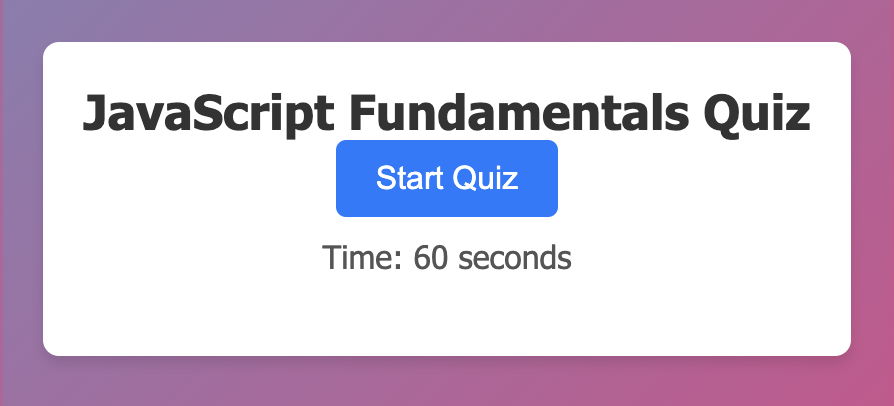

# JavaScript Quiz

## Screenshot 

 

## Overview
This JavaScript Quiz is an interactive web application designed to test you on your JavaScript fundamentals. It's built with HTML, CSS, and JavaScript. 
## Features
- **Start/Stop Quiz:** You can start the quiz at the click of a button. The quiz ends automatically when all questions are answered or the timer runs out.
- **Timed Questions:** Each question has a time limit. Incorrect answers result in a time penalty.
- **Score Submission:** At the end of the quiz, you can save your initials and score, which are stored locally.
- **Responsive Design:** The quiz is fully responsive, making it accessible on desktop, tablet, and mobile devices.

## Usage

1. **Start the Quiz:** Click on the "Start Quiz" button to begin.
2. **Answer Questions:** Choose your answers to the given JavaScript questions. Incorrect answers will deduct time from the clock.
3. **Submit Your Score:** Enter your initials at the end of the quiz to save your score locally.

## Contact

Email - [sklinkowize7@gmail.com](mailto:sklinkowize7@gmail.com)

